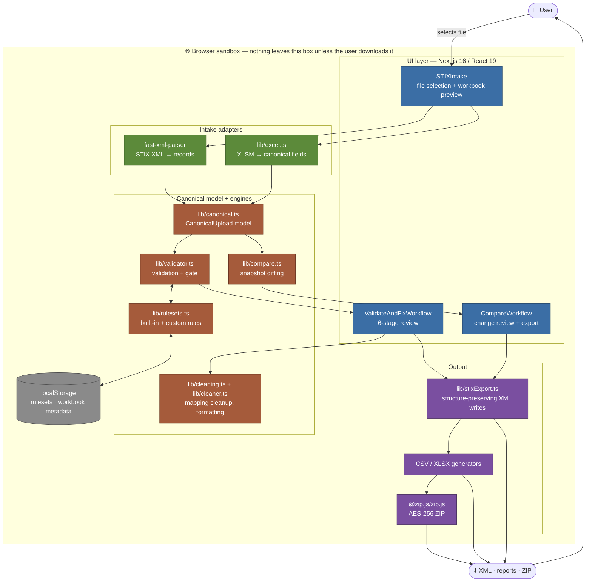
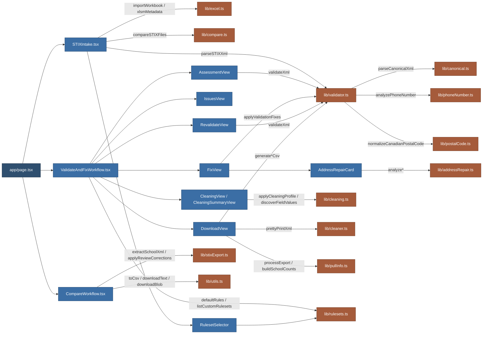
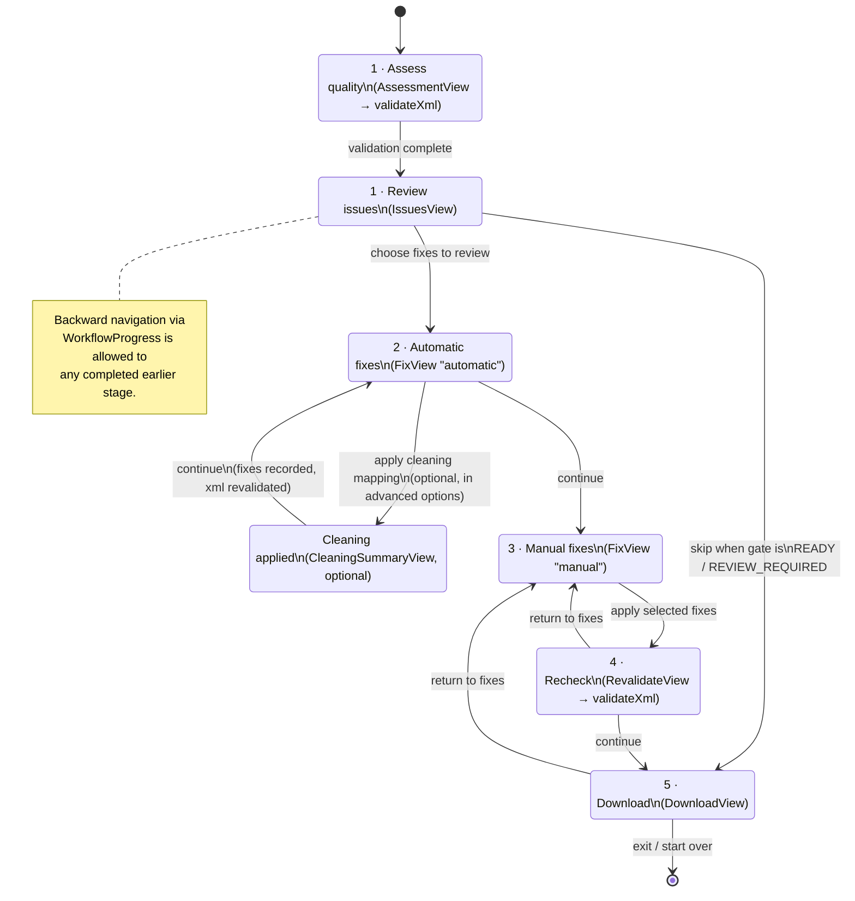
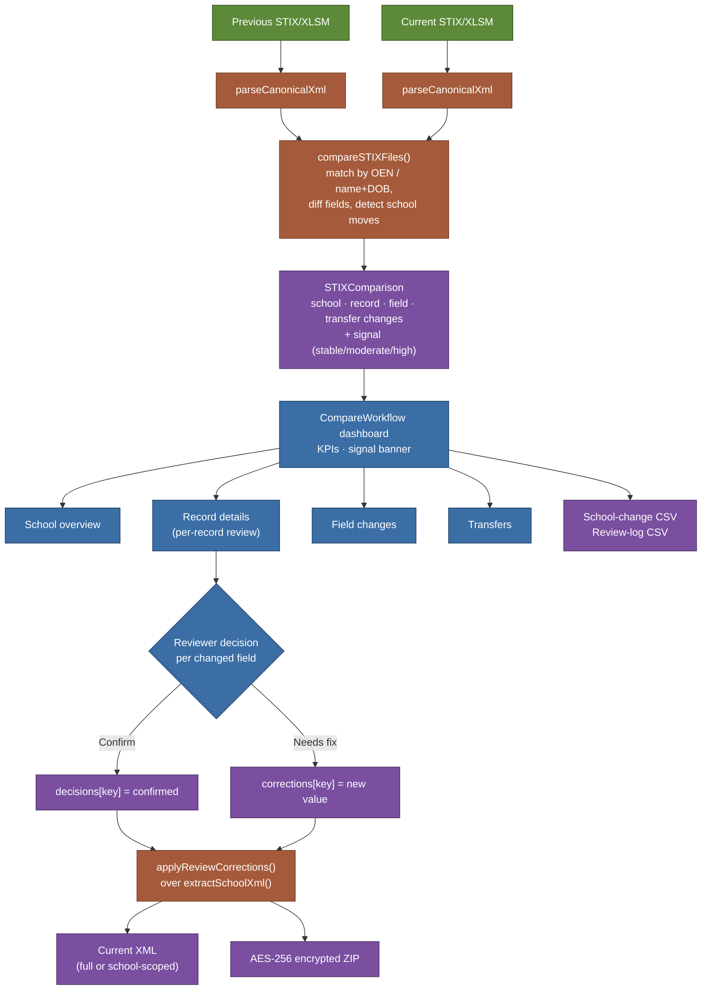
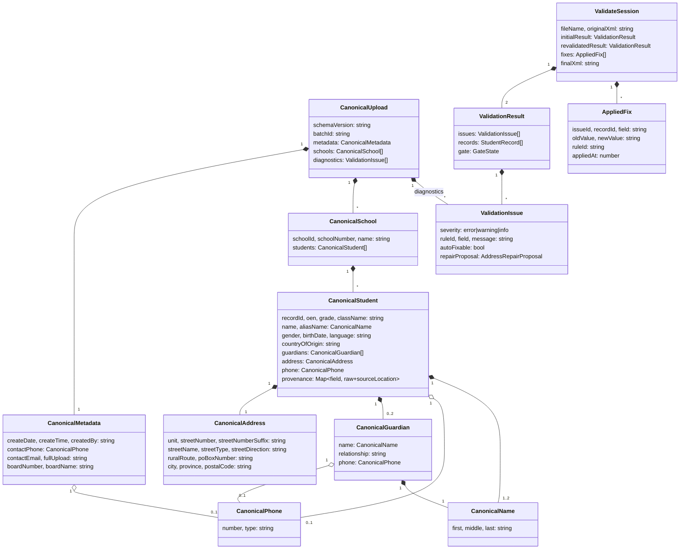
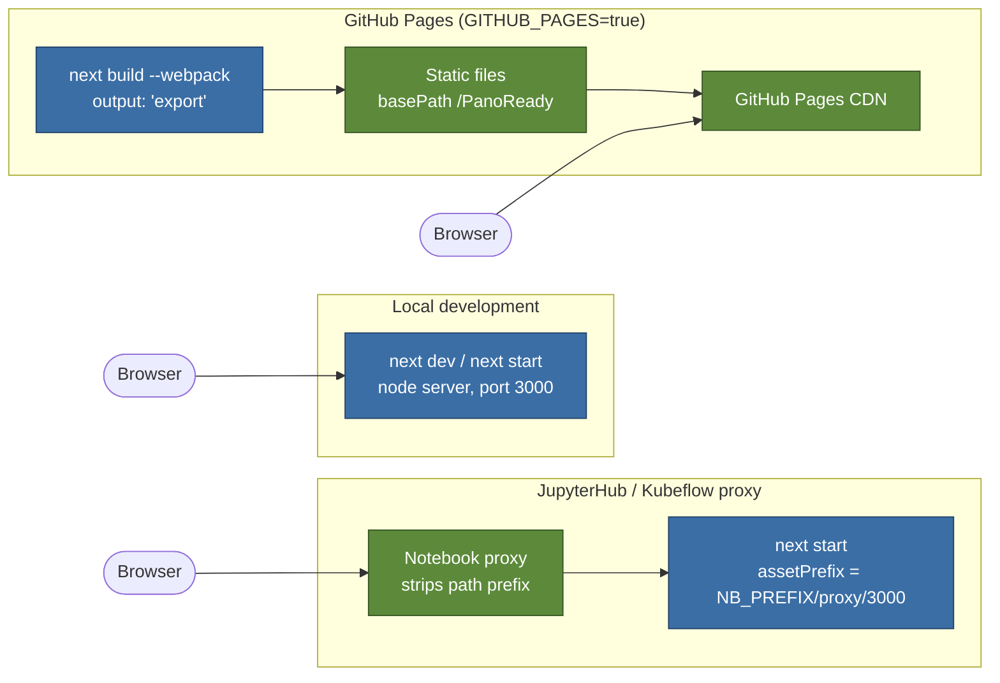

# Architecture diagrams

Visual companion to the [system design](system-design-panoready.md) document. Every diagram reflects the current implementation — component and module names match the files in the repository.

## 1. System overview

PanoReady has no backend. Everything below the browser boundary is a download the user explicitly triggers; nothing crosses the network.

## 2. Component map

How the top-level React components route into the `lib/` engines. Arrows show direct imports/calls, not data direction.

## 3. Validate & Fix — stage flow

The six on-screen stages described in the [Validate & Fix workflow](workflow-validate-and-fix.md) guide, as `ValidateAndFixWorkflow`'s internal state machine. "Clean summary" is optional and only reachable from Automatic fixes.

## 4. Compare Files — data flow

## 5. Workbook (XLSM) intake pipeline

How `.xlsm` uploads become STIX XML before either workflow ever sees them (`lib/excel.ts`).

```mermaid
flowchart LR
    File[".xlsm file"] --> Meta["xlsmMetadata()\ndiscover worksheet,\nfile-level metadata fields"]
    Meta --> Cache[("localStorage\npanoready:xlsm-metadata:v2:…")]
    Cache -. restores prior edits .-> Meta

    Meta --> Import["importWorkbook()"]
    Import --> Header["Header discovery\ncanonical aliases, not fixed positions"]
    Header --> Mapping{"Column status"}
    Mapping -->|MAPPED| Values["Value normalization\ndates, phones, units, lookups"]
    Mapping -->|UNMAPPED / DUPLICATE| Override["User column override\n(map or ignore)"]
    Override --> Values
    Mapping -->|IGNORED| Skip["excluded from output"]

    Values --> Preview["ImportPreview\ncolumns · diagnostics · counts"]
    Preview -->|blocking diagnostics present| Blocked["Import blocked\n(unmapped/duplicate column,\nambiguous date/phone, formula, count mismatch)"]
    Preview -->|clean| XmlOut["Generated STIX XML text"]

    XmlOut --> Downstream["parseSTIXXml() / validateXml()\n(same path as native XML upload)"]

    classDef step fill:#a55b3b,stroke:#6b3620,color:#fff
    classDef decision fill:#c9962c,stroke:#7a5a15,color:#111
    classDef terminal fill:#7a4fa0,stroke:#4a2f61,color:#fff
    class Meta,Import,Header,Values,Preview step
    class Mapping decision
    class XmlOut,Blocked,Downstream terminal
```

## 6. Canonical data model

The shared in-memory contract that both workflows validate, diff, and export against (`lib/canonical.ts`, `lib/types.ts`).

## 7. Deployment topology

`next.config.ts` switches output mode by environment; there is still no server-side data path in any of them — only where the static assets are served from changes.

---

*Diagrams are Mermaid and render directly on GitHub and in the published MkDocs site. Regenerate them when a workflow stage, module boundary, or data contract changes — see [`system-design-panoready.md`](system-design-panoready.md) for the prose description each diagram summarizes.*
